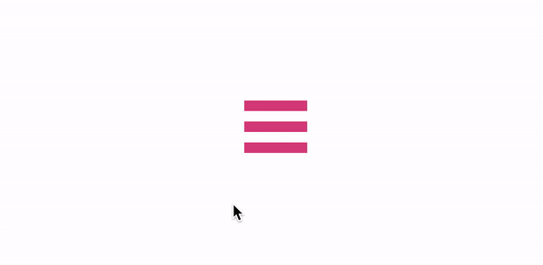

# Opdracht beschrijving

## Eindresultaat
Je gaat het eerder gemaakte hamburger menu annimeren, door de hamburger te veranderen in een kruisje wanneer de gebruiker er overheen hovert met de muis:

## Opdrachtbeschrijving
- Het hamburger-menu bestaat uit één basis-element (een `div`) en twee pseudo-elementen;
- De transities worden tweezijdig toegepast (zowel van *niet-hover*  → *hover* als van *hover*  → *niet-hover*)

## Stappenplan
1. Pak de content van EdHub over transities erbij.
2. Maak een container om de menu-balkjes heen in het HTML-bestand. We willen namelijk dat de animatie begint als de gebruiker zijn muis *ergens* over het gehele "vierkant" beweegt, niet alleen over het middelste balkje.
3. Geef die container voor nu even een border in een gekke kleur zodat je goed ziet tot waar hij rijkt. De bedoeling is dat hij precies om de drie balkjes heen staat.
4. Als de gebruiker over de *container* hovert, willen we dat het middelste balkje langzaam verdwijnt.
5. Tevens mag het bovenste balkje naar beneden draaien en het onderste balkje naar beneden.

## Antwoorden en gratis tips
Dit is een EdHub opdracht om je te helpen oefenen met de stof. Ben je vastgelopen? Kijk dan eerst even bij de volgende tips. Mocht het dan nog steeds niet lukken, kun je altijd een kijkje nemen bij de antwoorden in dezelfde repository, op de branch [uitwerkingen](https://github.com/hogeschoolnovi/frontend-css-hamburger-transition/blob/uitwerkingen/styles.css).

- *Tip bij stap **3***: haal de margin van het `#menu` element weg en vervang het door padding op het `#container` element
- *Tip bij stap **4***: focus je eerst op de begin- en eindstaat voor je je bezig houdt met transities. Het begin is een zichtbaar balkje. Het eind is een onzichtbaar balkje.
- *Tip bij stap **4 - vervolg***: als je de `opacity` aanpast doe je dat voor het basis element, en automatisch ook voor de pseudo-elementen. Niet ideaal dus, want de buitenste heb je nog nodig. Ga eens op zoek naar wat je kunt doen met de *kleur* van het middelste balkje...
- *Tip bij stap **5***: Benieuwd hoe je elementen kunt draaien? Google eens op *CSS transform property*